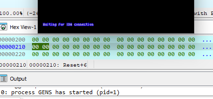
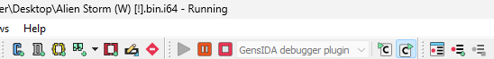
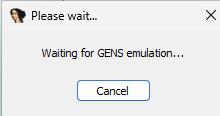
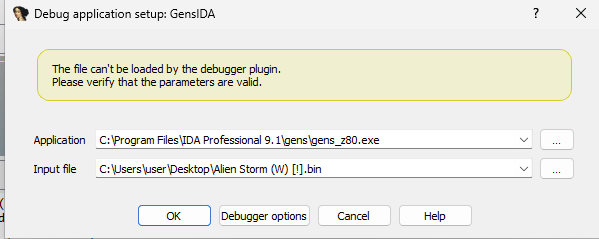

# Mega Drive Rom Hacking

## Prerequisites - Tools to install

* IDA Pro 9.1.250226 - [hex-rays.com/ida-pro](https://hex-rays.com/ida-pro)
* Sega Mega Drive Tools for IDA (second instance) - [lab313ru/smd_ida_tools2](https://github.com/lab313ru/smd_ida_tools2/releases)

## Installing Sega Mega Drive Tools for IDA

Extract the 7zip folder ( smd_ida_tools2_win_v3_3.7z ) and you will see this ->

I have installed everything in: "C:\Program Files\IDA Professional 9.1" ->
Including gens,scripts, loaders and plugins folders. The loaders and plugins are in IDA Pro 9.1 folder.

## How to use

* Open ROM in IDA
* Choose __GensIDA debugger plugin__ or __Z80 debugger plugin debugger__
* Press __F9__ to start a debugging process
* Run __gens_68k.exe__ or __gens_z80.exe__ from __gens__ folder, choose a ROM
* Debug!

## How to use an emulator

When you install the gens folder (see above). It installs 2 gens emulators. __gens_68k.exe__ is for graphics and __gens_z80.exe__ is for sound.

The Debugger wait for a connection to the emulator.

You have to Hit F9 a couple of times until you see Running ->

If you till can't get it to work try this.

If you hit Cancel in IDA Pro.

You come across this option to point to the emulator and rom:

